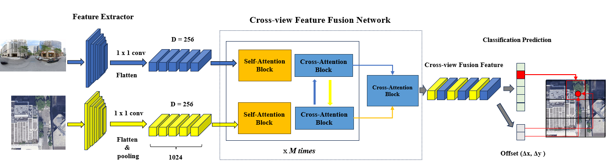

# Cross-Attention Between Satellite and Ground Views for Enhanced Fine-Grained Robot Geo-Localization [WACV'2024]


[[`Paper`](https://openaccess.thecvf.com/content/WACV2024/html/Yuan_Cross-Attention_Between_Satellite_and_Ground_Views_for_Enhanced_Fine-Grained_Robot_WACV_2024_paper.html)] 
[[`BibTeX`](#citation-information)]





### Paper Abstract
<p align="justify">
Cross-view image geo-localization aims to determine the locations of outdoor robots by mapping current street-view images with GPS-tagged satellite image patches. Recent works have attained a remarkable level of accuracy in identifying which satellite patches the robot is in, where the location of the central pixel within the matched satellite patch is used as the robot coarse location estimation. This work focuses on robot fine-grained localization within a known satellite patch. Existing fine-grain localization work utilizes correlation operation to obtain similarity between satellite image local descriptors and street-view global descriptors. The correlation operation based on liner matching simplifies the interaction process between two views, leading to a large distance error and affecting model generalization. To address this issue, we devise a cross-view feature fusion network with self-attention and cross-attention layers to replace correlation operation. Additionally, we combine classification and regression prediction to further decrease location distance error. Experiments show that our novel network architecture outperforms the state-of-the-art, exhibiting better generalization capabilities in unseen areas. Specifically, our method reduces the median localization distance error by 43% and 50% respectively in the same area and unseen areas on the VIGOR benchmark.
</p>

---
### 1. Environment 
<p align="justify">
please follow the requirements to setup your running environment
</p>

- Python >= 3.9
- Pytorch == 1.21.1
- torchvision == 0.13.1
- scikit-learn == 1.2.2
- numpy == 1.21.1
- einops == 0.6.1

### 2. Datasets
**VIGOR Dataset:** <br>
Please follow the guidelines from https://github.com/Jeff-Zilence/VIGOR to download and prepare the dataset. When using `readdata_VIGOR.py` to load images, please modify 'self.root' to your dataset storing directory.<br> 
<br>
**Oxford RobotCar Dataset:** <br>
Please contact the authors from https://github.com/tudelft-iv/CrossViewMetricLocalization/tree/main to get the processed Oxford RobotCar ground view images and the corresponding satellite images.
Please download the `Oxford_split` directory for data splitting.

---

### Citation Information
<p align="justify">
If our work is useful to your research, please kindly recognize our contributions by citing our WACV paper:
</p>

```
@InProceedings{Yuan_2024_WACV,
    author    = {Yuan, Dong and Maire, Frederic and Dayoub, Feras},
    title     = {Cross-Attention Between Satellite and Ground Views for Enhanced Fine-Grained Robot Geo-Localization},
    booktitle = {Proceedings of the IEEE/CVF Winter Conference on Applications of Computer Vision (WACV)},
    month     = {January},
    year      = {2024},
    pages     = {1249-1256}
}
```


